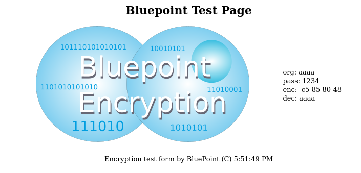

#  README
## The Bluepoint algorythm

 This directory contains the bluepoint algorithm and test suite.

    This is bluepoint version 1, version 2, and 3. See documentation on differences.

The bluepoint version 3, (the virtual machine execution version) is under
development, in beta, close to completion.

Version 3 might be quantum resistant;

The hs_crypt() family of functions are block handling loops to iterate
over buffers in a consistent manner.

#### Bluepoint 3 data flow:

    // Run through the pre-defined VM stack

    // Pre 1 - do password vector modification
    // This modifies the algorythm by virtue of the modified VM steps,
    // so the pass is connected to the virtual machine

    // Pre 2 - do the regular encryption process

    // Pre 3 - execute the static parts of the algorythm
    // This section is run in case the modified virtual machine creates
    // a short circuit (via unlikely pairs); with this static part, the scramble is
    // always strong

        PASSLOOP(+)
        MIXIT2(+)       MIXIT2R(+)
        HECTOR(+)       FWLOOP(+)
        MIXIT2(+)       MIXIT2R(+)
        PASSLOOP(+)     FWLOOP(+)
        HECTOR(+)       FWLOOP(+)
        MIXIT(+)        MIXITR(+)
        BWLOOP(+)       HECTOR(+)

    // Done

    // Decryption is run in reverse
    //   Static
    //   Regular
    //   Pass vector

 Both processes start with a password obfuscation;

#### Single bit in the pass propagetes to every byte:

    petergl@ubunew:~/pgsrc/bluepoint$ ./encrypt_blue2 -p 1111
    53ce29d3e9afd899b1a79bf4f1530870755d07d6c6e8619ff1fa
    petergl@ubunew:~/pgsrc/bluepoint$ ./encrypt_blue2 -p 1112
    50f334cc911a30a90f846b67128595899c3e04744a9bda168c21

#### Single bit in the payload propagetes to every byte:

    petergl@ubunew:~/pgsrc/bluepoint$ ./encrypt_blue2 11111111
    c8be9428c5a15c26
    petergl@ubunew:~/pgsrc/bluepoint$ ./encrypt_blue2 11111112
    7c34888116eb54d8

## Bluepoint 3 propagation:

    petergl@ubunew:~/pgsrc/bluepoint$ ./encrypt_blue2 -3 000000
    5be500bf0463
    petergl@ubunew:~/pgsrc/bluepoint$ ./encrypt_blue2 -3 000001
    9523adc84090

Sun 16.Oct.2022 updated bluepoint 3

// EOF
